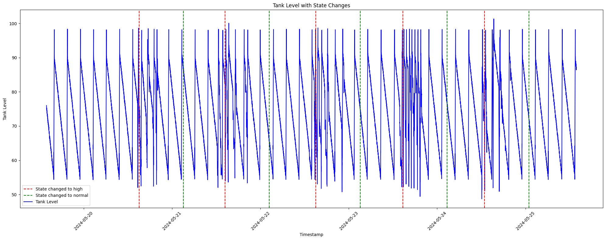
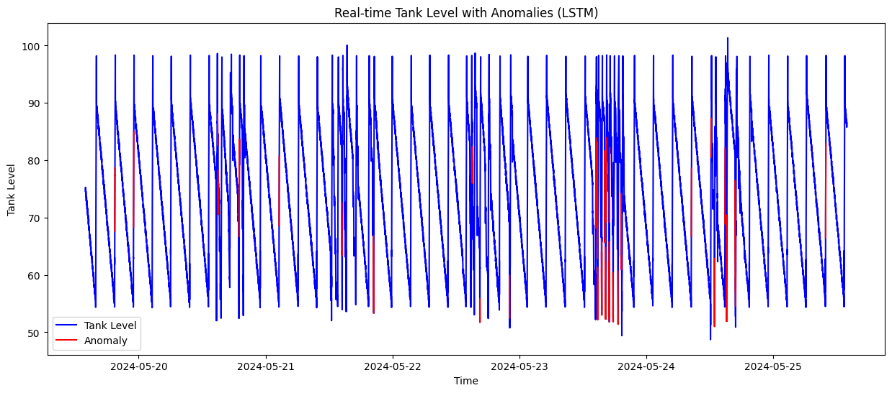
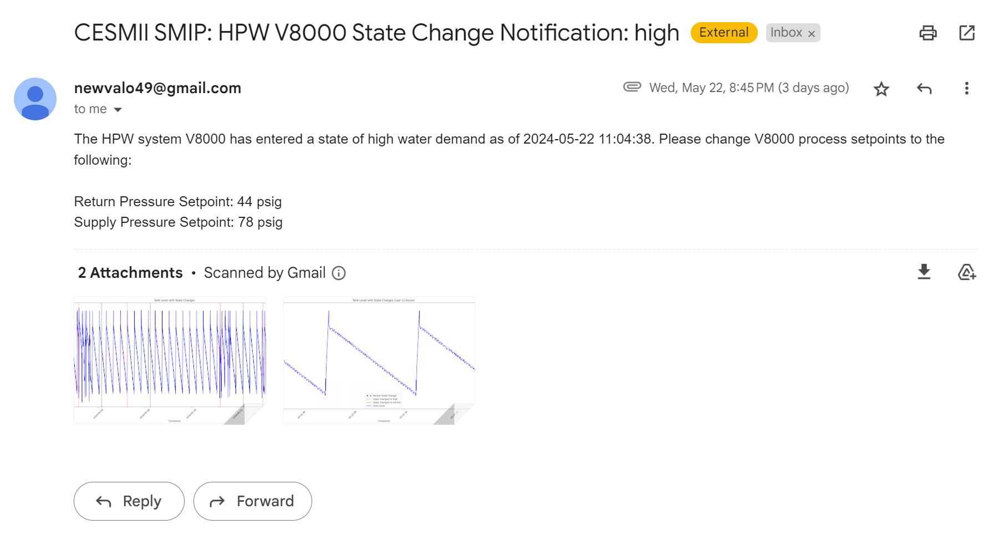
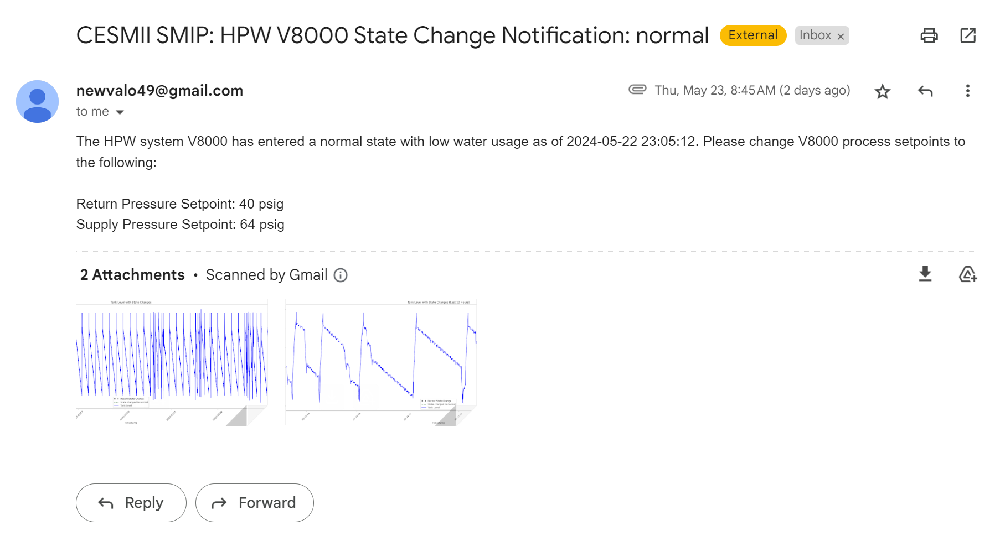

# NCSU BTEC Water Treatment Facility Anomaly Detection System

Welcome to the repository for the advanced Python-based analytical tool developed for the water treatment facility at North Carolina State University's Biomanufacturing Training and Education Center (BTEC). This system utilizes a sophisticated LSTM (Long Short-Term Memory) neural network to monitor, detect anomalies, and manage states in time series data, ensuring the facility operates at peak efficiency and reliability.

## 🚀 Features

- **Secure Token Retrieval for GraphQL Authentication**: Ensures protected access to operational data, with robust security measures for data interactions.

- **Enhanced GraphQL Request Handling**: Manages GraphQL requests efficiently, ensuring seamless data fetching operations even with token expiration and re-authentication.

- **Data Preprocessing**: Readies incoming data for the LSTM model by normalizing it to maintain compatibility, enhancing the system's analysis capabilities.

- **Anomaly Detection with LSTM**: Leverages LSTM networks to pinpoint unusual patterns in time series data, signaling potential operational disruptions early.

- **Dynamic Thresholding for Anomaly Detection**: Utilizes dynamic thresholding to accurately detect deviations from historical trends, improving sensitivity to operational anomalies.

- **State Management**: Adjusts operational states dynamically between "normal" and "high usage" based on detected anomalies, allowing proactive resource management. Below is a visual example of state transitions within the system:

    <!-- Placeholder for an image link showing state transitions -->

- **Visualization of Data and Anomalies**: Features intuitive graphical representations of time series data, anomalies, and state transitions, aiding in decision-making. Below is an example of how the system visualizes data:

    <!-- Placeholder for an image link showing an example of data visualization -->

- **Automatic Email Notifications**: Sends automated alerts upon significant anomaly detections or state changes, facilitating prompt action. Below are examples of the email notifications sent during different operational states:

  #### High State Email Alert
    <!-- Example image of a high state email alert -->

  #### Low State Email Alert
    <!-- Example image of a low state email alert -->

- **Scheduled Monitoring**: Enables autonomous regular checks and updates, boosting the system’s reliability and performance.

## 🌐 Running the Project

Deploy and run this project in your browser using this convenient Google Colab link:

## 📘 Usage

Follow these steps to utilize this system effectively:

1. **Authenticate**: Securely log in and retrieve data from the GraphQL endpoint.
2. **Preprocess Data**: Normalize the data to ensure it is ready for LSTM processing.
3. **Train the Model**: Use an appropriate data subset to train the LSTM autoencoder.
4. **Deploy the Model**: Apply the trained model to new or ongoing data streams for anomaly detection.
5. **Manage States**: Implement protocols to manage system states based on detected anomalies.
6. **Visualize**: Employ matplotlib for clear and actionable visual insights.

## 💻 Technology Stack

- **Python**: The backbone scripting language.
- **TensorFlow/Keras**: Used for LSTM modeling and training.
- **Pandas**: Key for efficient data handling and manipulation.
- **Matplotlib**: Essential for rendering insightful visualizations.
- **Requests**: Facilitates robust data fetching from the GraphQL API.
- **GraphQL**: Manages data queries and mutations efficiently, enabling sophisticated data integration and retrieval.

## 🙏 Acknowledgments

Special thanks to the NCSU BTEC Department, and all project contributors and maintainers for their relentless support and expertise.

---

For more information, updates, or to contribute, please visit the project repository on GitHub or contact me directly via email: [tanishraosams7@gmail.com](mailto:tanishraosams7@gmail.com).

